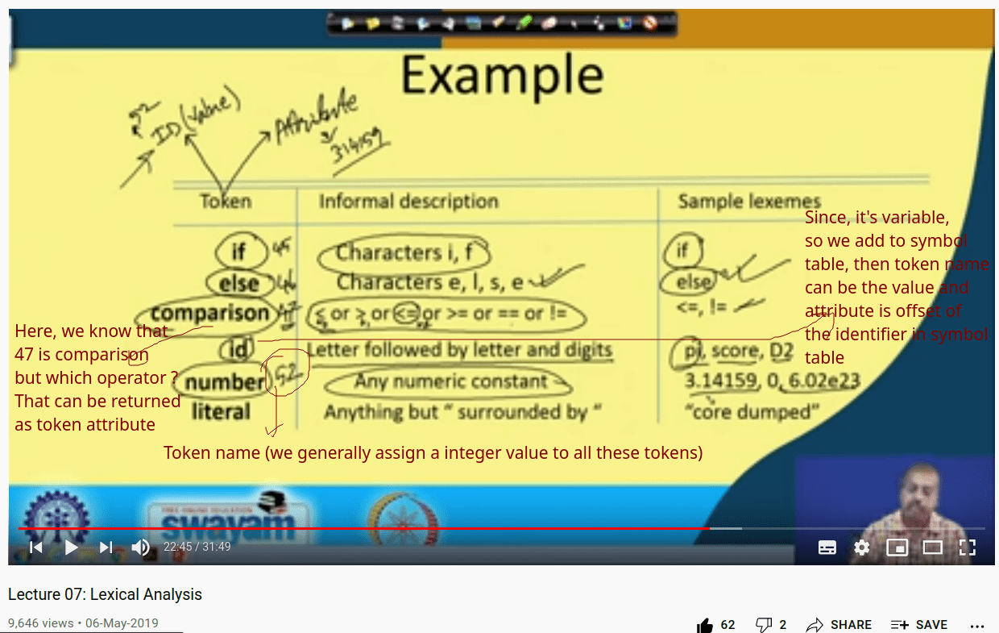
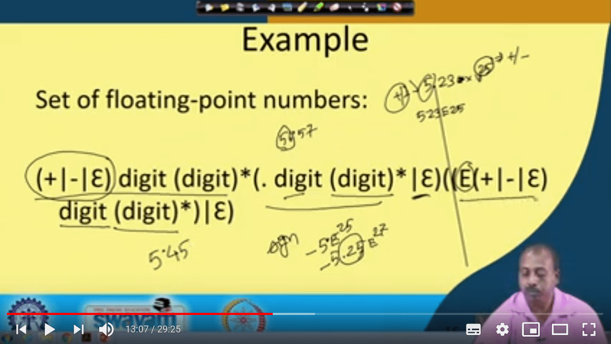
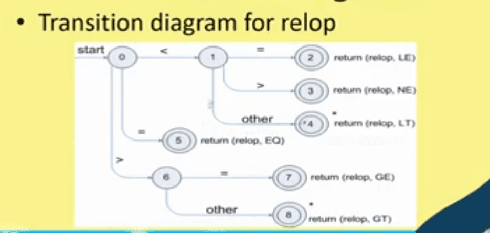

# Terms

* Token - Is a pair, a token name and an optional attribute (for eg. token name(often an integer) can be the value, and attribute is location of the lexeme (variable name) in symbol table.
* Pattern - description of the form that the lexeme of a token may take
* Lexeme - Sequence of characters that matched the pattern for a token



For eg.
```
F=M*C**2

Returned by lexical analyser:
  - <id, pointer to symbol table entry for E>
  - <assign-operator>
  - <id, pointer...>
  - <mult-op>
  - <id, pointer...>
  **- <exp-op>**
  - <number, integer value 2>
```

Note that in prev example, when parser asks for next token after C, lexical could have just returned mult-op due to \*, but it goes on to **find the longest matching pattern**, so it find \*\*.

## Where lexical can't handle error

```
fi(a == f(x)) ...
```

Lexical analyser doesn't know fi may be a function, so not necessary that it must be 'if', so it returns that thinking it is function name

## Regular expressions

Specified regular language

> L represents language, and is subset of all strings in the language

> Some rules for regular expressions were there



# Recognition of tokens

> **To identify the tokens of a lanugage we have to start with the grammar of the language**

Next step is formalize the patterns:
```
digit	-> [0-9]
digits	-> digit+
number	-> digits(.digits)?(E(+-)?digits)?
letter	-> [A-Za-z_]
id	-> letter(letter|digit)*
if	-> if
Then	-> then
Else	-> else
Relop	-> <|>|<=|>=|=|<>
whitespace -> (blank | tab | newline)+
```



# Finite Automata

* Regular Expressions -> _Specification_
* Finite automata     -> _Implementation_

It consists of:

- An input alphabet 𝛴
- States S
- Start state n
- A set of Accepting states F ⊆ S
- Set of transitions state -input-> state
