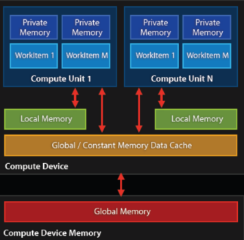

# OpenCL

To use, install vendor specific opencl library.

## Terminology

* Platform - Vendor specific OpenCL implementation
* Context  - Devices selected to work together

* Device   - Physical devices supporting OpenCL, CPU/GPU etc.
* Host - Client side calling code

* Kernel - The blueprint function that does the work
* Work Item - A unit of work executing a kernel
* Work groups - Collection of work items
* Command queue - The only way to communicate with a device, send it commands

* Memory - Local, global, private, constant
* Buffer - Alloted memory on GPU

* Compute Unit - Basically a work group + local memory

> From http://people.cs.bris.ac.uk/~simonm/montblanc/AdvancedOpenCL_full.pdf


## Kernels

```cpp
__kernel void func(__global int* input) {}
```

Either stored in a separate text file (generally .cl), or as string in source code.

Must:
* Have a `__kernel` (or kernel) prefix
* return void
* take at least one argument


