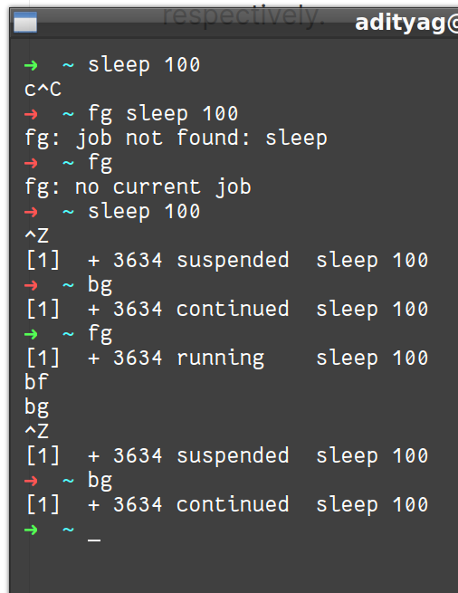

# Load Averages

It is average of 'load number' for a given period of time.

It takes into account these processes:
* Actively running on a CPU
* Considered runnable, (but waiting for CPU to become available)
* Sleeping (waiting for some resource (typically I/O) to become available)

> Linux differs from other Unix-like OSs, in that it includes 'sleeping processes' too.
>
> Linux only includes so-called 'uninterruptible' sleepers, ie. those which can't be awakened easily

Commands to see load avg- `w`, `top`, `uptime`

## Interpreting the values

It is tuple of 3 averages (eg. 0.45, 0.17, 0.12)

For single core (single-CPU) system, it means ->

* 0.45 - For the last minute, utilisation was 45%
* 0.17 - For the last 5 minutes
* 0.12 - For the last 15 minutes

If it is 1.00, means CPU utilised 100%
It more than 1.00, AND on single CPU, means the system was 'over-utilised', ie. **there were more processes needing CPU than CPU was available**

In case of multi-core, just divide the numbers you get by number of CPU (cores)

> Peek in 1st value is not problem (eg. at system startup), but peaks in 2nd or 3rd value may show a problem

# Background and Foreground Jobs

A job here is just a command run from a terminal window.

Foreground jobs -> run directly from shell; when one already running, other jobs need to wait for shell acces (atleast in that terminal window, if using GUI)

Background -> Add `&` after the command, to run in background, and **free the shell for other tasks**.

> The background process is executed with LOWER priority, so it can run itself, and also smooth execution for foreground jobs.

## Commands

* Ctrl - Z  => Suspend foreground job
* Ctrl - C  => terminate foreground job

* bg - Run process in background 
* fg - Run process in foreground

* jobs - List jobs (add '-l' to show PID also)

