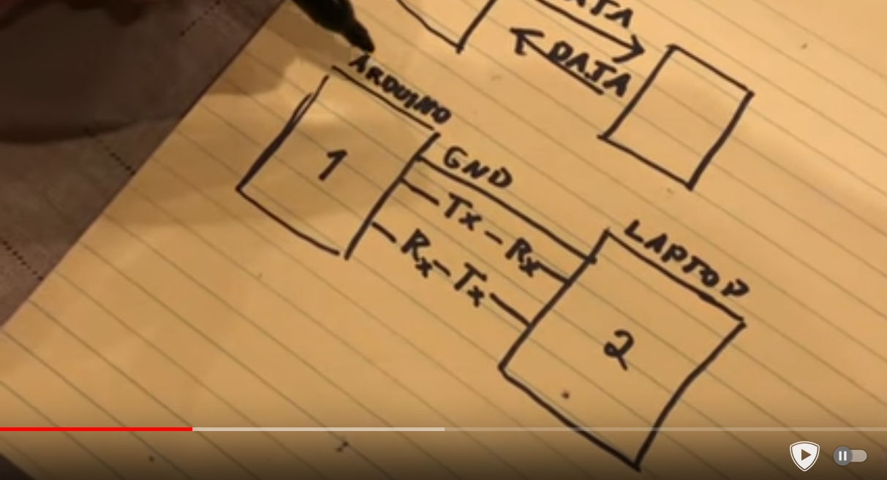

# Serial Communication

> Transmitting data in a line one after other

So, all bits are sent one by one, using just 1 cable

While in parallel communication, for eg. to send 8 bits, we use 8 + 1(ground
reference) wires,

Examples:
* SBUS
* PPM
* JTAG
* UART
* I2C
* CAN
* SPI
* MIDI
* USB
* RS-232

Types:
* Synchronous
* Asynchronous

# UART (U-ART)

Universal Asynchronous Receiver Transmitter

> Transmitter cable named TX, receiver cable named RX

1 TX(or RX) wire
+1 (ground reference)

How will we know when message starts, and which is bit ? Both TX and RX work
with same config:
* Transmission speed (Baud rate == bits/sec)
* Data length (how many bytes of message)
* Start & Stop bits

First low is START bit

> Bytes sent LSB first (ie. reversed), like in USB

How the value is read and understood -> https://youtu.be/IyGwvGzrqp8?t=303

> **Usually devices will have BOTH tx and rx pins, so they could both send and
> receive data with same protocol**
>
> **NOTE:** A single wire connected to Tx pin on sender, so called TX wire wrt
> system 1, and connects to Rx pin on receiver, so called Rx on receiver
>
> 
> 

