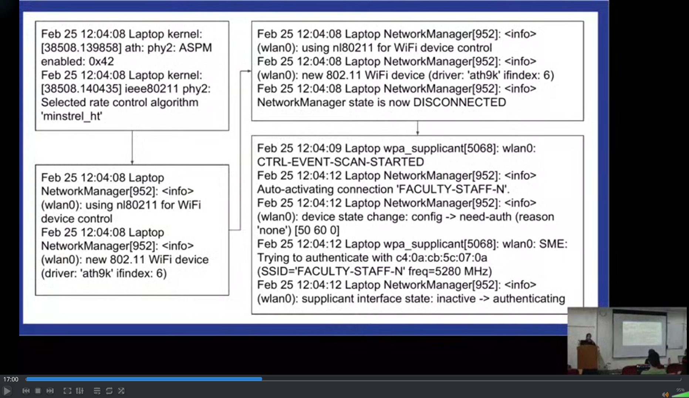
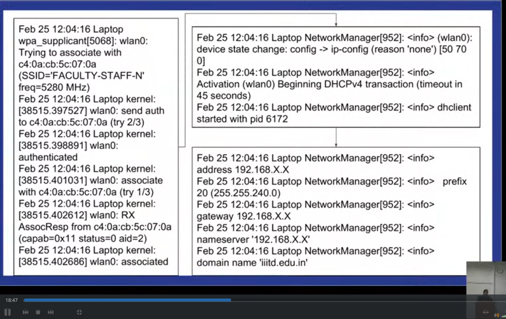

# Wifi Subsystem

> https://www.youtube.com/watch?v=AhW3wm4ILq4

Application
|
Presentation
|
Session
|
Transport
|
Network
|
----------
MLME/MAC
|
Physical
----------

MLME is sublayer of of MAC, which is logical link control, and MAC is Medium
Access Control.

> MAC also provides unique address, known as MAC address

MAC is a layer that has many algorithms that decide when & how a packet should
be sent. If transmission not successful, decide what can be done to make it
successful, basically wait then sent, ie. listen to the channel, if it's free
send else wait for some time.

MLME is subpart of MAC, decides how all this should be managed, in coding this
is the part we generally modify

#### MLME - MAC SubLayer Management Entity
* Authenticate
* Deauthenticate
* Associate
* Disassociate
* Beacon
* Probe

> For example, in mobile, first thing we enter WPA key (etc), after this we get
> **associated**, we won't have an IP address till now, since IP layer is above
> the MAC layer.
> It is still possible to communicate over MAC layer, though we don't have an IP
> address, for eg. in phones, even if connected over MAC, though don't have an
> IP address, it says Not Connected, but actually we will be connected, we can
> communicate but we just dont have the TCP/IP standard.


 The above two - Wifi IEEE 802.11


> ## Modes of Wifi
>
> * Infrastructure Mode
> For PC to communicate to Printer, it has to go through the Access Point 
>
> * Ad hoc / Wifi Direct
> Decentralised
>

## Commands

#### Know your wifi card

```sh
lshw -C network
```

#### iwconfig
> Once connected, even if we dont have an IP yet


#### ifconfig
> Once we have got the IP address, can run this to get all details of the IP
> address

## Network Managers

In android, doesn't have a separate network manager, it is called
"WPA_Supplicant" (the dropdown to chose wifi network to connect to), so changes
have to be made into WPA_Supplicant

For a linux machine, it can be NetworkManager, WICD, WPA_Supplicant etc.
But check in background only one is running to see the effect

## Type of Wifi Devices

* Full MAC - MAC in hardware (for eg. phones)
* Soft MAC - MAC in software (for eg. Athenos chipsets)

## Wifi Interface Modes

```sh
iw list
```

```
Supported interface modes:
                 * IBSS
                 * managed
                 * AP
                 * AP/VLAN
                 * monitor
                 * P2P-client
                 * P2P-GO
                 * P2P-device
software interface modes (can always be added):
                 * AP/VLAN
                 * monitor
```

For eg. to make a laptop as an access point, first check if it is even possible
to do, (she said 'hostapd' is the command to do that, but first check, i think
the required interface mode is "Host AP" should be there)
> https://www.cyberciti.biz/faq/debian-ubuntu-linux-setting-wireless-access-point/

* P2P-client and P2P-go are ad hoc mode (WIFI direct mode)
* Meshpoint is also ad hoc
* monitor mode is to capture packets
* managed is default mode we generally use

## Linux Wifi Subsystem

**User space**

Applications (wpa_supplicant, network manager)

**Kernel space**

MAC Drivers  (nl80211, cfg80211, mac80211)

|

Device drivers (ath9k)

**Hardware**

Wifi Chipset (AR9462, BCM4322)

> 90% changes will be done in mac80211, which is in the MAC layer

Device drivers load order: cfg80211 -> mac80211 -> ath9k

> After a driver modifications, this module order needs to be followed before
> inserting for eg. ath9k

LibNL, Wireless Information
* /usr/include/linux/nl80211.h
* /proc/net/wireless
* /proc/net/dev

Events
* Wifi connection establishment:
  * Associate
  * Authenticate
* DHCP
  * Network IP

* Terminal commands to see logs:
tail -f /var/log/syslog or `dmesg` (grep for wpa_supplicant, network manager,
kernel, dhclient)




> First authentication happened (automatic since NetworkManager knew password),
> then comes association
> 
> Once authenticated, for process of association, all Wifi frames are being
> shared b/w client and access point.
> Once done, AssocResp status=0 means successfully associated
>
> Then comes the IP comes then TCP, it will say that DHCP transation should
> begin, (dhc client allows device to get an IP address)
>

> TIP: ;)
If doing any controlled 'experiment', even if dont have IP address, we are still
connected, and can actually communicate with the access point, because connected
over LAN, there are other ways of communication because we don't have IP yet

### See link quality and noise

```sh
watch -n1 "cat /proc/net/wireless"
```

### Info about Network packets
```sh
watch -n1 "cat /proc/net/dev"
```


