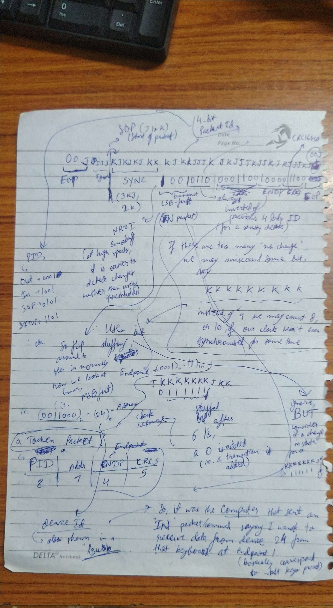

# PS2

> Source: https://www.youtube.com/watch?v=wdgULBpRoXk

Four pins: ground, 5 volts (for power to keyboard)
           other two provide two signals to communicate

Each time a key is pressed, keyboard sends one or more burst of data on those two pins

Each burst includes 11 clock pulses, and corresponding data,
Start bit, 8 bits data, parity bit, stop bit

